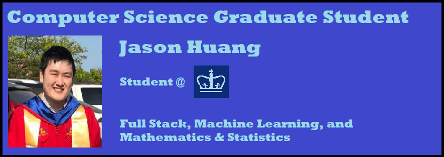

# Jason Huang - Full Stack Software Engineer
### Summary
My definition of "full stack" is the ability to recognize and write quality code for the application, server, database, network, and hardware. This also entails the ability to be familiar with computational methods such as machine learning, operations research, graph theory, natural language processing, etc. To that extent, I'd like to become an expert software engineer that can manage all software stacks.

I will receive my M.S. in Computer Science at City of New York Columbia University specializing in the Machine Learning Track.

I've received my B.S. double majoring in Computer Science and Applied Mathematics & Statistics at Stony Brook University.

**Programming Languages: JavaScript/TypeScript, Python, Java, Ruby, Swift, C#, C/C++**

**Frameworks: React, Express, MongoDB, SQL, InfluxDB, Hadoop, Spark, OpenCV, TensorFlow, Rails, Kubernetes, Docker**

  

  
  
  

   

## GitHub Stats  

  

  

  

 
