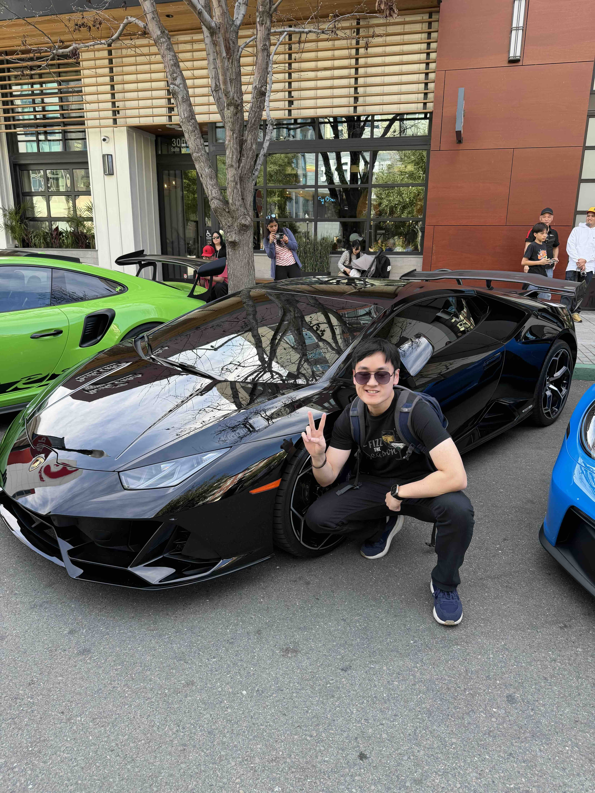

 
 

 

 
 

 
 

  

<table width="100%">
  <tr>
    <th align="left" width="33%">Product</th>
    <th align="left" width="33%">Systems</th>
    <th align="left" width="34%">Applied Work</th>
  </tr>
  <tr>
    <td>React interfaces</td>
    <td>Services and APIs</td>
    <td>Data engineering</td>
  </tr>
  <tr>
    <td>Full-stack products</td>
    <td>Infrastructure and DevOps</td>
    <td>Graph algorithms</td>
  </tr>
  <tr>
    <td>Operational tooling</td>
    <td>Production reliability</td>
    <td>IoT and robotics</td>
  </tr>
</table>

 
 

 
 

| Engineering Range | Education |
| --- | --- |
| Production software, product UI, services, infra, and operations | **M.S. Computer Science**, Columbia University |
| Data workflows, graph algorithms, research tooling, IoT, and robotics | **B.S. Computer Science**, Stony Brook University |
| Full-stack foundation with breadth across applied systems | Applied Mathematics & Statistics |

 
 

| Area | Tools |
| --- | --- |
| **Languages** | TypeScript, JavaScript, Python, Java, Ruby, Go, Swift, C#, C, C++, SQL |
| **Product and Services** | React, Node.js, Express, Rails, Django, REST APIs, Firebase |
| **Infrastructure and Data** | Kubernetes, Docker, AWS, Google Cloud Platform, Azure, PostgreSQL, MongoDB, MySQL, Redis, Spark, Hadoop |
| **Applied Systems** | OpenCV, TensorFlow, Scikit-learn, NumPy, graph algorithms, IoT systems, robotics |

 
 

 

